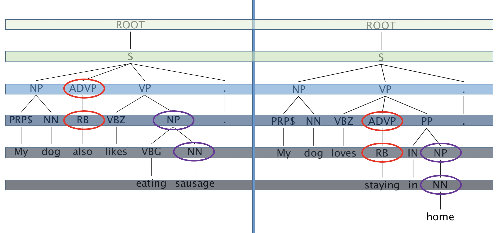
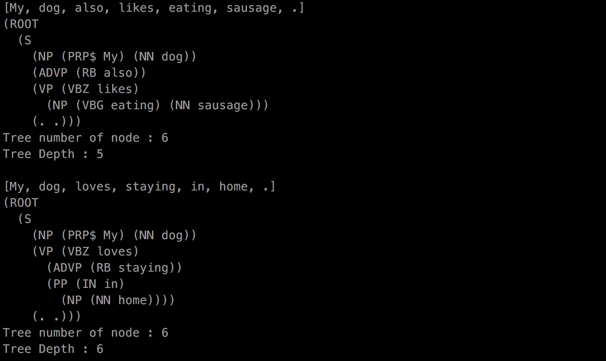
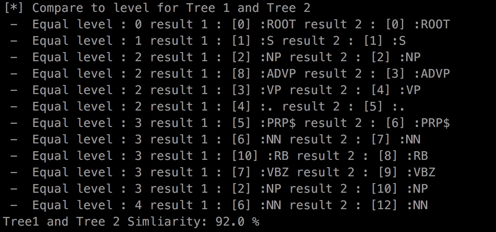

Stanford Lexicalized Parser v3.8.0 - 2017-06-09
-----------------------------------------------

Copyright (c) 2002-2015 The Board of Trustees of The Leland Stanford Junior
University. All Rights Reserved.

[Stanford Parser](https://nlp.stanford.edu/software/lex-parser.shtml)

This software requires Java 8 (JDK 1.8.0+).  (You must have installed it
separately. Check that the command "java -version" works and gives 1.8+.)

[Presentation URL](https://docs.google.com/presentation/d/1thaVUe1AJXHzA_Sr1ZsDIALL8PkUm57DuSTufkJS1nM/edit?usp=sharing)

## [QUICK START]
### GUI
```sh
$ ./lexparser-gui.sh
```
### Complie
```sh
$ javac -classpath ./stanford-parser.jar:./stanford-parser-3.8.0-sources.jar:./stanford-parser-3.8.0-models.jar ParserTreeSimilarity.java
```

### Execution
```sh
$ java -classpath 'stanford-parser.jar:stanford-parser-3.8.0-models.jar:slf4j-api.jar:ejml-0.23.jar:' ParserTreeSimilarity edu/stanford/nlp/models/lexparser/englishPCFG.ser.gz data/test-1.txtenglishRNN.ser.gz data/test.txt
```
### Example


### Parse Tree


### Similarity

